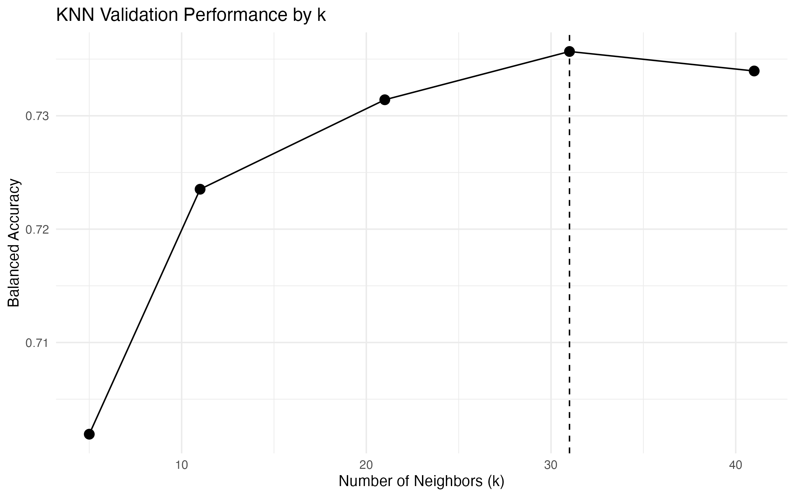
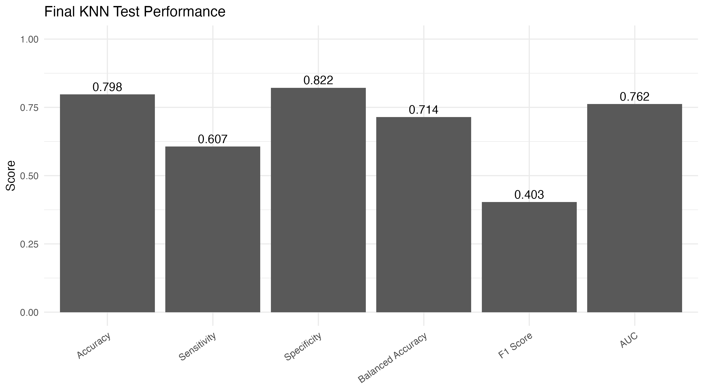
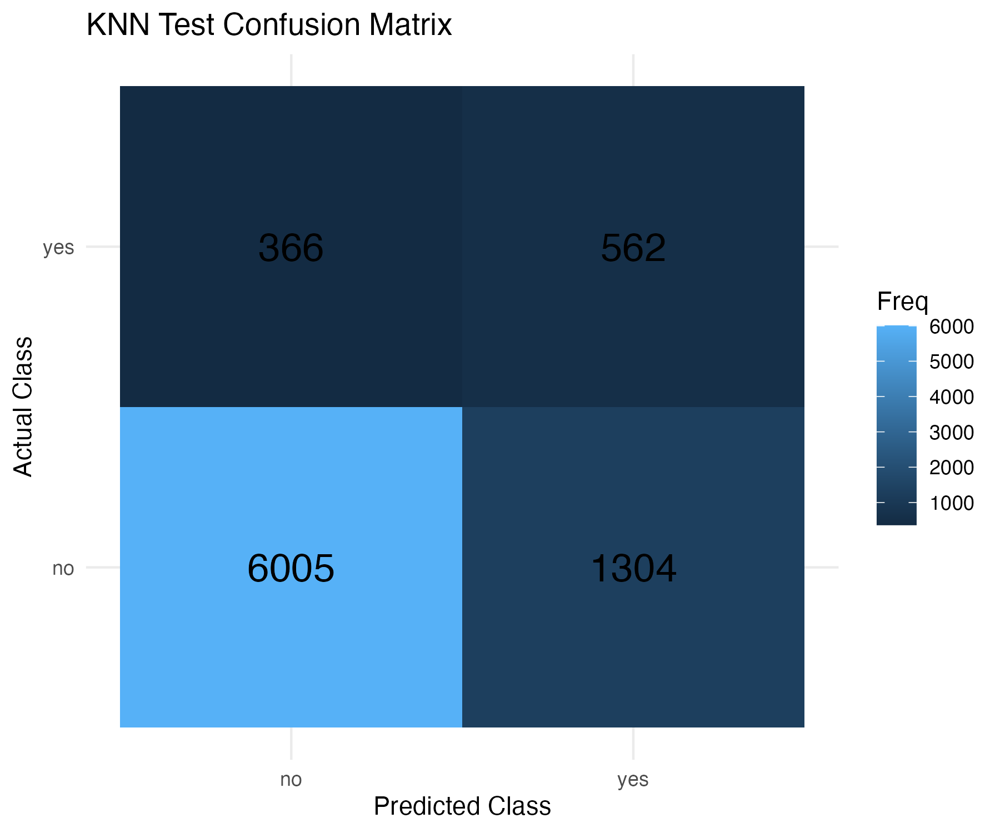

# KNN Classification Pipeline in R

A classification project using K-Nearest Neighbors (KNN) in R, developed as my individual contribution to a five-person AMS 580 team project at Stony Brook University.

## Project Context

The original course project was completed collaboratively by a five-person team and involved building and evaluating classification models using separate training and testing datasets.

This repository contains only **my KNN-related contribution** to the project. Other team members developed additional modeling components, which are intentionally not included here.

The course required model development using the training data, with validation or cross-validation used for model selection and the provided test set reserved for final evaluation.

## Collaboration

This repository represents only my documented contribution to the original team project. The complete collaborative source code is not included in order to keep individual contributions clearly separated.

## My Contribution

My work focused on the K-Nearest Neighbors classification pipeline, including:

- Preparing predictors for distance-based classification
- Creating training and validation subsets
- Standardizing numerical predictors using training-set statistics
- Encoding categorical variables for KNN
- Aligning predictor structures across training, validation, and test data
- Removing near-zero-variance predictors
- Addressing class imbalance through balanced training samples
- Evaluating multiple values of `k`
- Selecting the final `k` using validation performance
- Evaluating the selected model on the held-out test set
- Reporting classification metrics and confusion-matrix results

## Technology

- R
- caret
- class
- pROC
- dplyr
- tidyverse

## Model Selection

Multiple values of `k` were evaluated using the validation set, with
balanced accuracy used as the primary selection metric because of class imbalance.



The validation results selected **k = 31** for the final KNN model.

## Final Test Performance

The selected model was evaluated once on the held-out test set.



The model achieved approximately:

- Accuracy: 0.798
- Sensitivity: 0.607
- Specificity: 0.822
- Balanced Accuracy: 0.714
- F1 Score: 0.403
- AUC: 0.762

### Confusion Matrix



## Repository Structure

```text
knn-classification-pipeline-r/
│
├── README.md
├── .gitignore
├── .gitattributes
│
├── analysis/
│   └── knn_classification.Rmd
│
├── data/
│   ├── training_data.csv
│   └── testing_data.csv
│
└── docs/
    └── images/
        ├── knn_validation_by_k.png
        ├── knn_test_metrics.png
        └── knn_confusion_matrix.png
## Disclaimer

This project was completed for academic and educational purposes.
